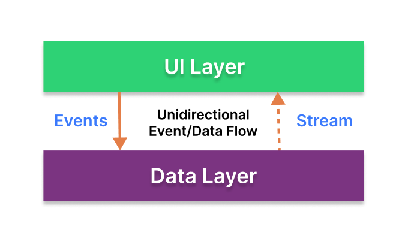

<h1 align="center">Fitstyle</h1>

<p align="center">
  <a href="https://opensource.org/licenses/Apache-2.0"></a>
  <a href="https://android-arsenal.com/api?level=21"></a>
</p>

<p align="center">Fitstyle is an app that allows users to merge photos and art to create styled images. This app showcases modern Android development with Kotlin, Coroutines, Flow, Jetpack, Hilt, Material Design and an MVVM architecture.</p>

<p align="center">

</p>

## Tech stack 
- Minimum SDK level 21.
- [Kotlin](https://kotlinlang.org/) based, utilizing [Coroutines](https://github.com/Kotlin/kotlinx.coroutines) + [Flow](https://kotlin.github.io/kotlinx.coroutines/kotlinx-coroutines-core/kotlinx.coroutines.flow/) for asynchronous operations.
- Jetpack Libraries:
  - Lifecycle: Observes Android lifecycles and manages UI states upon lifecycle changes.
  - ViewModel: Persists UI state, handles events and provides access to business logic through configuration changes.
  - Navigation: Facilitates screen navigation, complemented by [Hilt Navigation Compose](https://developer.android.com/jetpack/compose/libraries#hilt) for dependency injection.
  - Room: Provides an abstraction layer over SQLite for seamless database access.
  - DataBinding: Binds UI components in your layouts to data sources in your app using a declarative format rather than programmatically.
  - [Hilt](https://dagger.dev/hilt/): Dependency injection library to manage dependencies. 
- Architecture:
  - MVVM Architecture (View - ViewModel - Model): Facilitates separation of concerns and promotes maintainability.
  - Repository Pattern: Acts as a bridge between different data sources and the application's business logic.
- [Retrofit2 & OkHttp3](https://github.com/square/retrofit): A type-safe HTTP client for consuming RESTful APIs.
- [Moshi](https://github.com/square/moshi): A modern JSON library for Kotlin and Java.
- [Glide](https://github.com/bumptech/glide): An image loading library that fetches and displays network images.
- [AWS Amplify](https://github.com/aws-amplify/amplify-android): An Android library that facilitates interaction with AWS services. 

## Architecture
**Fitstyle** adopts the MVVM architecture and implements the Repository pattern, aligning with [Google's official architecture guidance](https://developer.android.com/topic/architecture).


### Architecture Overview

The architecture is constructed of two distinct layers, the UI layer and the data layer.

### UI Layer


The role of the UI layer is to display application data and handle user interactions. It consists of UI elements that render the data on the sreen and state holders such as the [ViewModel](https://developer.android.com/topic/libraries/architecture/viewmodel) which can persist UI states through configuration changes and provide access to business logic.

### Data Layer


The role of the data layer is to hold, manage, and provide access to the application data. It is made of repositories that abstract data sources from the rest of the app and contain business logic such as retrieving local or remote data. This layer adopts the single source of truth (SSOT) principle which ensures that all data is accessed and updated through a centralized repository for consistency and reliability.<br>




Both the UI and data layer adhere to the [Unidirectional Data Flow](https://developer.android.com/topic/architecture/ui-layer#udf) (UDF) pattern which enforce a separation of responsibility between the layers. In UDF, state flows moves in one direction and events that modify the data (e.g user actions) flow in the opposite direction.

This loosely coupled, layered architecture improves the maintainability, quality and robustness of the overall app.

# License
```xml
Designed and developed by 2024 gojoel (Joel Goncalves)

Licensed under the Apache License, Version 2.0 (the "License");
you may not use this file except in compliance with the License.
You may obtain a copy of the License at

   http://www.apache.org/licenses/LICENSE-2.0

Unless required by applicable law or agreed to in writing, software
distributed under the License is distributed on an "AS IS" BASIS,
WITHOUT WARRANTIES OR CONDITIONS OF ANY KIND, either express or implied.
See the License for the specific language governing permissions and
limitations under the License.
```
